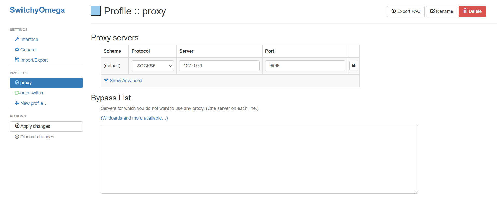

In the examples below, replace `<your_username>` with your SWC HPC username.

## Connecting to jupyterhub server:

0) If not connected to SWC's intranet:

- In a terminal, SSH to the HPC using the SOCKS5 protocol to listen to a local port (here 9997) that is not currently in use: `ssh -D 9997 <your_username>@ssh.swc.ucl.ac.uk`

- In the browser, set up a proxy server with the SOCKS5 protocol to go to localhost (server 127.0.0.1) on the forwarded port (9997). (On Chrome this can be done via the "SwitchyOmega" chrome extension)

    

1) In a terminal, set up SSH local port forwarding to a port (here 9998) that is not currently in use and forward to HPC-GW1 port 22:
```
ssh -L 9998:hpc-gw1:22 <your_username>@ssh.swc.ucl.ac.uk
```

2) In a new terminal, SSH into the HPC via the forwarded port on localhost, activate the aeon environment, disable the `nbclassic` jupyter server extension, and open the jupyterhub server on the HPC via its IP on port 2222:    
```
ssh -Y <your_username>@localhost -p 9998
conda activate aeon
jupyter server extension disable nbclassic
jupyter-lab --no-browser --ip 192.168.234.1 --port 2222
```

3) Copy and paste the URL returned in the terminal from step 2 into your browser.

See the [aeon_analysis](https://github.com/sainsburyWellcomeCentre/aeon_analysis) repo for example notebooks that you can play with in the jupyterhub session.
